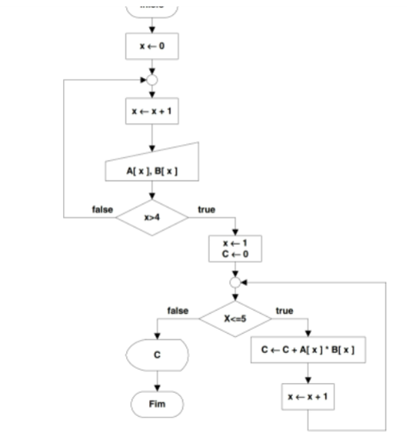

# Exercício 2 da AF
Vetores A e B

## Algoritmo do Exercício

    INÍCIO
        VAR 
        x <- 0
        a: cadeia
        b: cadeia

        x <- x + 1
        A[4,6,7,1,0]
        B[7,1,3,1,2]

        ENQUANTO x > 4, FAÇA
            x <- 1
            C <- 0
        FIM ENQUANTO

        SE x <= 5, FAÇA
            ENQUANTO x <= 5, FAÇA
            EXIBIR(C <- C + A[x] * B[x])
            x <- x + 1
            FIM ENQUATO
        SE NÃO
            EXIBIR(C)
        FIM SE    
    FIM

## Fluxograma
